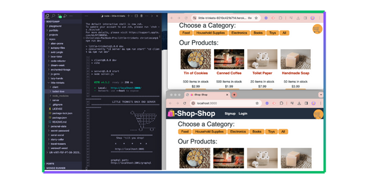

npm <p align="center">


</p>

[](https://opensource.org/licenses/MIT)
[](https://nodejs.org/en)
[](https://expressjs.com/)
[](https://redux.js.org/)
[](https://react.dev/)
[](https://www.mongodb.com/)
[](https://www.apollographql.com/)
[](https://heroku.com)
[](https://canva.com/)
[](https://vitejs.dev/)

<p align="left">
  
</p>

### 

- [OVERVIEW](#overview)
  - [_user story_](#user-story)
  - [_acceptance criteria_](#accpetance-criteria)
  - [_trinket list_](#trinket-list)
- [INSTALLATION](#installation)
- [USAGE](#usage)
  - [_screenshot_](#screenshot)
  - [_demo_](#demo)
- [TESTING](#testing)
- [SOURCES](#sources)
- [LICENSE](#license)
- [LINKS](#links)
- [CONNECT](#connect)

### 


### 

<p align="center">
  
</p>

### 

<p align="center">
  
</p>

### 

<p align="center">
  
</p>

#

### 

The application is invoked using the following commands:

##### _Clone the repository in your local development enviornment_

```javascript
git clone https://github.com/christiecamp/little-trinkets.git
```

##### _Navigate to the CLI and input:_

```javascript
npm i
```

```javascript
npm run seed
```

```javascript
npm run dev
```

#

### 

**INSTRUCTIONS:**

1. Open the Integrated Terminal and follow the [installation](#installation) guidelines.

2. Interact with `LITTLE TRINKET` through your local enviornment, or open the [application](https://little-trinkets-6010c421b714.herokuapp.com/) deployed on [Heroku](https://heroku.com/home).

3. Signup by providing your name, email address, & by creating a password.

4. **Shop for products** by category

5. _View_, _save_, & _delete_ your selected products in **Order History**.

6. Checkout products through [stripe]()

7. _Logout_ to leave application.

##### view [demo videos](#demo) for further help

### 

##### \*screenshot demonstrates `LITTLE TRINKET's` back end, local browser, & deployed application on **Heroku\***

<p align="center">

</p>

### 

<p align="center">

</p>

#

### 

Here's a list of technologies used:

1. [Node.js](https://nodejs.org/en) - an open-source, cross-platform JavaScript runtime environment.

2. [Express.js](<(https://expressjs.com)>) - a minimal and flexible Node.js web application framework that provides a robust set of features for web and mobile applications.

3. [Apollo Server](https://webpack.js.org/) - an open-source, spec-compliant **GraphQL server** that's compatible with any **GraphQL client**, including [Apollo Client](). Works in conjunction with [apollo-server-express](https://www.npmjs.com/package/apollo-server-express), an _Express integration_ of Apollo Server.

4. [Apollo Client](https://www.npmjs.com/package/@apollo/client) - a fully-featured caching GraphQL client with integrations for `React`, `Angular` - easily build UI components that fetch data via **GraphQL**.

5. [GraphQL](https://graphql.org/) - an open source _query language_ that describes how a client should request information through an API.

6. [MongoDB](https://www.mongodb.com/) - a _NoSQL_ database product that utilizes **JSON**-like documents with optional schemas.

7. [Mongoose](https://mongoosejs.com/) - a Node.j based **Object Data Modeling** _(ODM) library_ for MongoDB.

8. [React](https://react.dev/) - open-source **JavaScript UI development library** for building user interfaces based on _components_. It is used with:

   - [react-bootstrap](https://www.npmjs.com/package/react-bootstrap)
   - [react-dom](https://legacy.reactjs.org/docs/react-dom.html)
   - [react-router-dom](https://www.npmjs.com/package/react-router-dom)
   - [@types/react](https://www.npmjs.com/package/@types/react)
   - [@types/react-dom](https://www.npmjs.com/package/@types/react-dom)

9. [eslint](https://eslint.org/) - a _static code analysis tool_ for identifying problematic patterns found in JavaScript code. It is used with:

   - [eslint-plugin-react](https://www.npmjs.com/package/eslint-plugin-react)
   - [eslint-plugin-react-hooks](https://www.npmjs.com/package/eslint-plugin-react-hooks)
   - [eslint-plugin-react-refresh](https://www.npmjs.com/package/eslint-plugin-react-refresh)

10. [Vite](https://vitejs.dev/guide/) - a build tool that aims to provide a faster and leaner development experience for modern web projects.

11. [brypt](https://www.npmjs.com/package/bcrypt) - a password hashing algorithm.

12. [jsonwebtoken]() - an implementation of [JSON Web Tokens](https://datatracker.ietf.org/doc/html/rfc7519).

13. [jwt-decode](https://www.npmjs.com/package/jwt-decode) - decode, sign/resign or verify **JSON Web Tokens**.

14. [Dotenv](https://www.npmjs.com/package/dotenv) - a zero-dependency module that loads environment variables from a .env file into `process.env`.

15. [Concurrently](https://www.npmjs.com/package/concurrently) - a Node.js tool that runs multiple commands concurrently.

16. [Nodemon](https://www.npmjs.com/package/nodemon) - a Node.js tool that helps develop applications by automatically restarting the node application when file changes in the directory are detected.

17. [stipe](https://www.npmjs.com/package/stripe) - Node library that provides convenient access to the Stripe API from applications written in server-side JavaScript.

18. [Heroku](https://heroku.com) - used to deploy, manage, and scale the application.

### 

##### [mit license](./LICENSE)

### 

##### [*github repo*](https://github.com/christiecamp/little-trinkets)

##### [*deployed app*](https://little-trinkets-6010c421b714.herokuapp.com/)

### 

[](https://github.com/christiecamp/enchanted-forage)

<a href="mailto:christiecamphoto@gmail.com">

</a>
